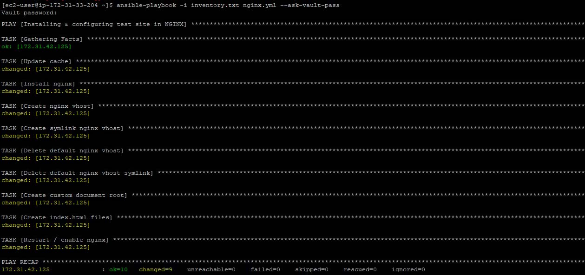

# Test Site Provision through Ansible Playbook

[](https://travis-ci.org/joemccann/dillinger)

In this project we’ll focus on getting a simple website set up in NGINX through ansible playbook on an Ubuntu 20.04 LTS server.

## Pre-requisites

- Used Ansible Master server as Amazon Linux 2 and Client server as Ubuntu 20.04 LTS.
- Ansible Master server is installed with Ansible2.
- Variables such as Domain Name, Port No, Documentroot, User and Group are provided through the nginx.vars file.

## Ansible Modules Used

- [Inventory](https://docs.ansible.com/ansible/2.3/intro_inventory.html/)
- [File](https://docs.ansible.com/ansible/2.3/list_of_files_modules.html)
- [Template](https://docs.ansible.com/ansible/2.5/modules/template_module.html)

## Resources Used

- Amazon Linux 2 (Ansible-Master)
- Ubuntu 20.04 (Ansible-Client)
- Nginx (webserver)
- Ansible2

## Instructions

First let's create a directory in our master server. Now clone my Github repository [ansible_nginx](https://github.com/tajroshith/ansible_nginx) to your master server which is pre-installed with Ansible2. After cloning the repository, edit your Inventory file accordingly and modify the "nginx.vars" with the desired values. 
Also here I have used SSH private key based login. So I have copied the ssh private key file as "EXAMPLE_KEY.pem" in the same directory with read permission granted to the User/Owner.

```sh
yum install git -y
amazon-linux-extras ansible2 -y
```

Now let's check the connection status to the client server via:

```sh
ansible -i inventoryfile all -f 1 -m ping
```

After successfully establishing connection to the remote server let's check for any error's in our playbook via:

```sh
ansible-playbook -i inventoryfile nginx.yml --syntax-check
```

Now let's execute the ansible-playbook via:

```sh
ansible-playbook -i inventoryfile nginx.yml
```
## Screenshot

## Securing files

We have used "nginx.vars" file to pass the variables as a plain text, to overcome this we can encrypt the files with a password. Ansible-vault encrypts variables and files so you can protect sensitive content such as passwords or keys rather than leaving it visible as plaintext in playbooks.

To encrypt a file, we use the ansible-vault command
```sh
ansible-vault encrypt nginx.yml nginx.vars inventoryfile EXAMPLE_KEY.pem
```
To prompt for the password:
```sh
ansible-playbook -i inventoryfile  nginx.yml --ask-vault-pass
```
